## Writeup Advance Lane Finding

---

**Advanced Lane Finding Project**

The goals / steps of this project are the following:

* Compute the camera calibration matrix and distortion coefficients given a set of chessboard images.
* Apply a distortion correction to raw images.
* Use color transforms, gradients, etc., to create a thresholded binary image.
* Apply a perspective transform to rectify binary image ("birds-eye view").
* Detect lane pixels and fit to find the lane boundary.
* Determine the curvature of the lane and vehicle position with respect to center.
* Warp the detected lane boundaries back onto the original image.
* Output visual display of the lane boundaries and numerical estimation of lane curvature and vehicle position.


## [Rubric](https://review.udacity.com/#!/rubrics/571/view) Points

### Here I will consider the rubric points individually and describe how I addressed each point in my implementation.  

---

### Writeup / README

#### 1. Provide a Writeup / README that includes all the rubric points and how you addressed each one.  

You're reading it!

### Camera Calibration

#### 1. Briefly state how you computed the camera matrix and distortion coefficients. Provide an example of a distortion corrected calibration image.

Given a list (List_Files) of chessboard calibrationn images (with nx*ny squares) I use the functions `cv2.findChessboardCorners` and `cv2.calibrateCamera` to compute the calibration matrix and the distortion coefficients of the camera. The code for this step is the following:
```python
def Calibration_Matrix (List_Files, nx, ny):
    Objects_Points = []
    Image_Points = []
    for Files in List_Files:

        Obj_Pts = np.zeros((nx*ny,3), np.float32)
        Obj_Pts[:,:2] = np.mgrid[0:nx,0:ny].T.reshape (-1,2)
        #Find chessboard corners on distorted chessboard image    
        img = cv2.imread(Files)
        gray = cv2.cvtColor(img, cv2.COLOR_BGR2GRAY)
        ret, corners = cv2.findChessboardCorners(gray, (nx, ny), None)
        if ret == True:
            Image_Points.append(corners)
            Objects_Points.append(Obj_Pts)
    ret, mtx, dist, rvecs, tvecs = cv2.calibrateCamera(Objects_Points, Image_Points, gray.shape[::-1], None, None)
    return mtx, dist
```
Having The matrix and the coefficients, I used the funnction, `cv2.undistort()` to apply the correction. 
```python
List_Files = glob.glob('camera_cal/calibration*')
nx = 9
ny = 6

Mtx, Dist = Calibration_Matrix (List_Files, nx, ny)
for Files in List_Files:
    base=os.path.splitext(os.path.basename(Files))[0]
    Img = mpimg.imread(Files)
    Undistorted_Img = cv2.undistort(Img, Mtx, Dist, None, Mtx)
    f, (ax1, ax2) = plt.subplots(1, 2, figsize=(24, 9))
    f.tight_layout()
    ax1.imshow(Img)
    ax1.set_title('Original Image', fontsize=50)
    ax2.imshow(Undistorted_Img)
    ax2.set_title('Undistorted Image', fontsize=50)
    plt.subplots_adjust(left=0., right=1, top=0.9, bottom=0.)
    f.savefig('camera_cal_output/' + base + '_output.jpg')
```
An example applied to a distorted chessboard images

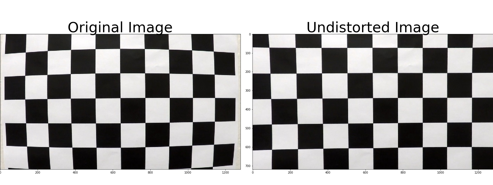

### Pipeline (single images)

#### 1. Provide an example of a distortion-corrected image.

Having computed the calibration parameters of the matrix before, I used the function `cv2.undistort()`,to undistort the test images.
```python
Img = mpimg.imread('test_images/' + Image_Name) #Image_Name is the name of the image with the extension
    Base_Name = os.path.splitext(Image_Name)[0] #Base_Name is the name of the image without the extension
    Undistorted_Img = cv2.undistort(Img, Mtx, Dist, None, Mtx)
    plt.imsave('output_images/' + Base_Name + '_Step2_Undistorted.jpg', Undistorted_Img)
```
The following example is provided:

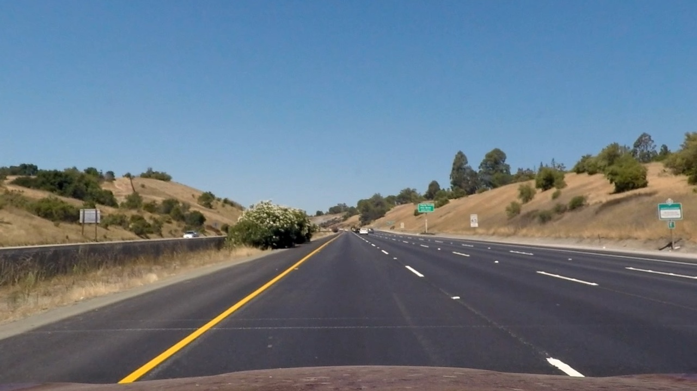

#### 2. Describe how (and identify where in your code) you used color transforms, gradients or other methods to create a thresholded binary image.  Provide an example of a binary image result.

To apply thresholds filtering of color and gradients I defined the following functions:
* The absolute gradient threshold in x and y directions defined by:
```python
def Absolute_Sobel_Threshold(Img, orient='x', sobel_kernel=3, Abs_thresh=(0, 255)):
    gray = cv2.cvtColor(Img, cv2.COLOR_RGB2GRAY)
    if orient == 'x':
        Sobel = cv2.Sobel(gray, cv2.CV_64F, 1, 0,ksize = sobel_kernel)
    if orient == 'y':
        Sobel = cv2.Sobel(gray, cv2.CV_64F, 0, 1,ksize = sobel_kernel)
    Abs_Sobel = np.absolute(Sobel)
    Scaled_Sobel = np.uint8(255*Abs_Sobel/np.max(Abs_Sobel))
    grad_binary = np.zeros_like(Scaled_Sobel)
    grad_binary[(Scaled_Sobel >= Abs_thresh[0]) & (Scaled_Sobel <= Abs_thresh[1])] = 1
    return grad_binary
```
* The magnitude gradient threshold defined by:
```python
def Magnitude_Threshold(Img, sobel_kernel=3, mag_thresh=(0, 255)):
    gray = cv2.cvtColor(Img, cv2.COLOR_RGB2GRAY)
    Sobelx = cv2.Sobel(gray,cv2.CV_64F,1,0,ksize = sobel_kernel)
    Sobely = cv2.Sobel(gray,cv2.CV_64F,0,1,ksize = sobel_kernel)
    Mag_Sobelxy = np.sqrt(np.square(Sobelx) + np.square(Sobely))
    Scaled_Mag_Sobelxy = np.uint8(255*Mag_Sobelxy/np.max(Mag_Sobelxy))
    mag_binary = np.zeros_like(Scaled_Mag_Sobelxy)
    mag_binary[(Scaled_Mag_Sobelxy >= mag_thresh[0]) & (Scaled_Mag_Sobelxy <= mag_thresh[1])] = 1
    return mag_binary
```
* The gradient direction threshold defined by:
```python
def Direction_Threshold(Img, sobel_kernel=3, dir_thresh=(0.7,1.3)):
    gray = cv2.cvtColor(Img, cv2.COLOR_RGB2GRAY)
    Sobelx = cv2.Sobel(gray, cv2.CV_64F,1,0,ksize = sobel_kernel)
    Sobely = cv2.Sobel(gray, cv2.CV_64F,0,1,ksize = sobel_kernel)
    Abs_Sobelx = np.absolute(Sobelx)
    Abs_Sobely = np.absolute(Sobely)
    Grad_Dir = np.arctan2(Abs_Sobely, Abs_Sobelx)
    dir_binary = np.zeros_like(Grad_Dir)
    dir_binary[(Grad_Dir >= dir_thresh[0]) & (Grad_Dir <= dir_thresh[1])] = 1
    return dir_binary
```
* The S color channel threshold defined by:
```python
def S_Color_Threshold(Img, S_Color_thresh = (0, 255)):
    hls = cv2.cvtColor(Img, cv2.COLOR_RGB2HLS)
    S = hls[:,:,2]
    S_binary = np.zeros_like(S)
    S_binary[(S >= S_Color_thresh[0]) & (S <= S_Color_thresh[1])] = 1
    
    return S_binary
```
Combining this different functions to the undistorted images, with differents parameters for kernel size and thresholds, I was able to generate a binary image. The code and the tuning parameters are shown below:
```python
S_Color_binary = S_Color_Threshold(Undistorted_Img, S_Color_thresh = (150,255))
Absolute_Sobel_x = Absolute_Sobel_Threshold(Undistorted_Img, orient='x', sobel_kernel=9, Abs_thresh=(20, 120))
Absolute_Sobel_y = Absolute_Sobel_Threshold(Undistorted_Img, orient='y', sobel_kernel=9, Abs_thresh=(20, 120))
Magnitude_Sobel = Magnitude_Threshold(Undistorted_Img, sobel_kernel=9, mag_thresh=(50, 255))
Direction_Sobel = Direction_Threshold(Undistorted_Img, sobel_kernel=15, dir_thresh=(0.7,1.3))
Binary_Img = np.zeros_like(S_Color_binary)
Binary_Img [((Absolute_Sobel_x == 1) & (Absolute_Sobel_y == 1)) | ((Magnitude_Sobel == 1) & (Direction_Sobel == 1)) |
            (S_Color_binary == 1)] = 1
plt.imsave('output_images/' + Base_Name + '_Step3_Combined_Binary.jpg', Binary_Img, cmap='gray')
```
Here's an example of my output for this step.  

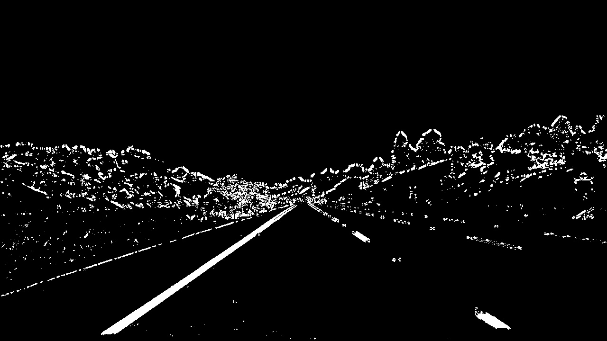

#### 3. Describe how (and identify where in your code) you performed a perspective transform and provide an example of a transformed image.

To perform the perspective transform, i defined the source points using the most obvious example of the straight lines images. A rectangle in the undistorted image is well defined by points on the lanes for these images. Since all images have the same specs, the same sources can be used for all images. The drawn rectangle is shown below:

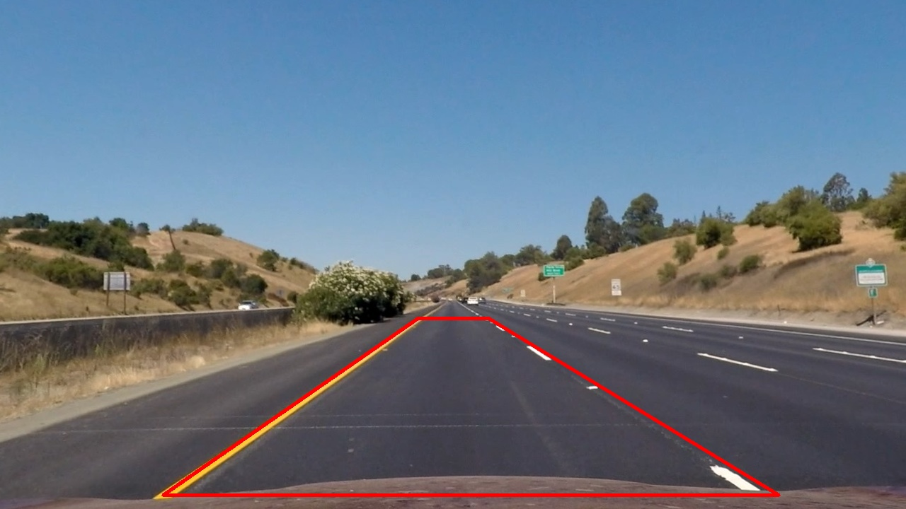

The destination points are also choosen in a way to have complete warped image of the lanes and also parallel lanes in case of a straight lines. I used then the `cv2.warpPerspective()` to compute the direct and inverse matrix for the perspective transform. The code is shown below:
```python
#Defining a rectangle on the image
src = np.float32([[230, 700], [1100, 700], [690, 450], [590, 450]])

#Defining destination points of the rectangle in the warped image
dst = np.float32([[230,700], [1000, 700], [1000,0], [230,0]])

#Draw rectangle on undistorted image
Undistorded_Rectangle = np.copy(Undistorted_Img)
cv2.polylines(Undistorded_Rectangle, np.int32([src]), True, (255,0,0),4)
plt.imsave('output_images/' + Base_Name + '_Step4_1_Perspective_Source.jpg', Undistorded_Rectangle)

#Calculating direct and inverse matrix of the perspective transform
M = cv2.getPerspectiveTransform(src, dst)
Minv = cv2.getPerspectiveTransform(dst, src)
Binary_Warped_Img = cv2.warpPerspective(Binary_Img, M, (Binary_Img.shape[1], Binary_Img.shape[0]), flags=cv2.INTER_LINEAR)
plt.imsave('output_images/' + Base_Name + '_Step4_2_Binary_Warped.jpg', Binary_Warped_Img, cmap='gray')
```
Here's an example of my output for this step.  

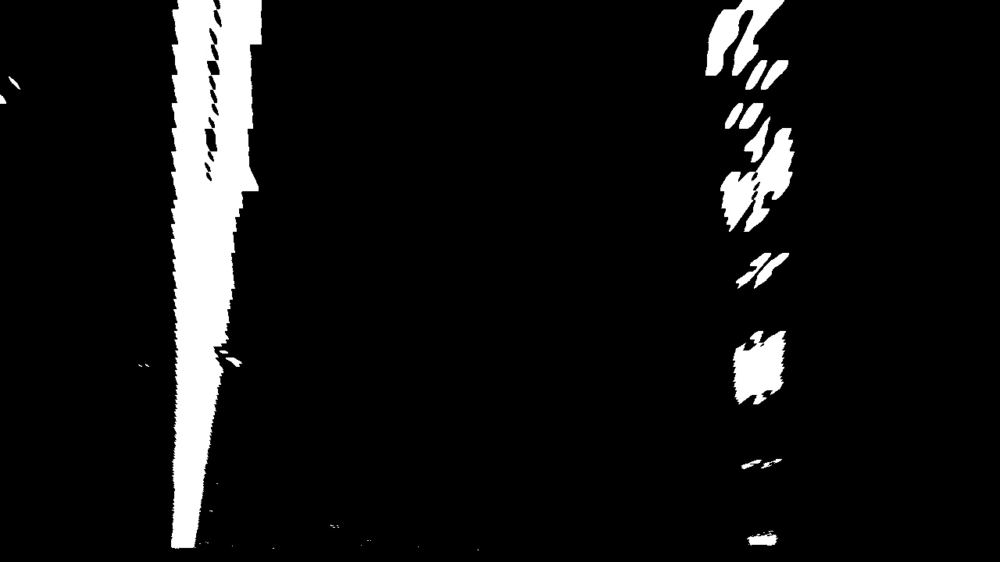

#### 4. Describe how (and identify where in your code) you identified lane-line pixels and fit their positions with a polynomial?

To identify the pixel belonging to each lane i defined the functions `Identify_Lane_Pixels()`, which by goes through the following steps:
1. perform an histogram across the bottom half of the image;
1. Find the base of each lane by identifying the histogram peaks on the left and right half of the histogram;
1. Define a window around those bases and find activated pixels in the neighborhood defined by this window;
1. Update the base with the mean of activated pixels if we obtain a minimal amount of activated pixels Min_Pixel;
1. Slide the window and repeat steps 3 and 4 until the top of the image is reached;
1. Return the list of activated pixels for each lane

```python
def Identify_Lane_Pixels(Binary_Warped_Img):
    #Identify starting points for pixel search based on the histogram
    histogram = np.sum(Binary_Warped_Img[Binary_Warped_Img.shape[0]//2:,:], axis=0)
    Left_x_Start = np.argmax(histogram[:histogram.shape[0]//2])
    Right_x_Start = np.argmax(histogram[histogram.shape[0]//2:]) + histogram.shape[0]//2
    
    #Search parameters
    Window_Number = 10
    Margin = 110
    Min_Pixel = 50

    Final_Out_Img = np.dstack((Binary_Warped_Img, Binary_Warped_Img, Binary_Warped_Img))*255

    Window_Height = np.int(Binary_Warped_Img.shape[0]//Window_Number)
    
    #Identifying indexes of all active pixels
    Non_Zero = Binary_Warped_Img.nonzero()
    Non_Zero_x = np.array(Non_Zero[1])
    Non_Zero_y = np.array(Non_Zero[0])

    #Initializing the search
    Left_Lane_Ind = []
    Right_Lane_Ind = []
    Left_x_Current = Left_x_Start
    Right_x_Current = Right_x_Start
    
    # Search over the windows
    for n in range(Window_Number):
        #Identify window boundaries
        Window_y_Low = Binary_Warped_Img.shape[0] - (n+1)*Window_Height
        Window_y_High = Binary_Warped_Img.shape[0] - n*Window_Height
        Window_Left_x_Low = Left_x_Current - Margin
        Window_Left_x_High = Left_x_Current + Margin
        Window_Right_x_Low = Right_x_Current - Margin
        Window_Right_x_High = Right_x_Current + Margin
        
        #Draw window boundaries on image output
        cv2.rectangle(Final_Out_Img,(Window_Left_x_Low, Window_y_Low), (Window_Left_x_High, Window_y_High), (255,0,0),2)
        cv2.rectangle(Final_Out_Img,(Window_Right_x_Low, Window_y_Low), (Window_Right_x_High, Window_y_High), (255,0,0),2)

        #Identify active pixels within the window boundaries      
        Left_Ok = ((Non_Zero_y >= Window_y_Low) & (Non_Zero_y < Window_y_High) &
                   (Non_Zero_x >= Window_Left_x_Low) & (Non_Zero_x < Window_Left_x_High)).nonzero()[0]

        Right_Ok = ((Non_Zero_y >= Window_y_Low) & (Non_Zero_y < Window_y_High) &
                   (Non_Zero_x >= Window_Right_x_Low) & (Non_Zero_x < Window_Right_x_High)).nonzero()[0]
        
        #Add found pixels to the whole list of active pixels
        Left_Lane_Ind.append(Left_Ok)
        Right_Lane_Ind.append(Right_Ok)
        
        #Recenter the window if needed
        if len(Left_Ok) > Min_Pixel:
            Left_x_Current = np.int(np.mean(Non_Zero_x[Left_Ok]))
        if len(Right_Ok) > Min_Pixel:
            Right_x_Current = np.int(np.mean(Non_Zero_x[Right_Ok]))
    
    try:
        Left_Lane_Ind = np.concatenate(Left_Lane_Ind)
        Right_Lane_Ind = np.concatenate(Right_Lane_Ind)
    except ValueError:
        pass

    #Extract all active pixels for left and right lane
    Left_x_Active = Non_Zero_x[Left_Lane_Ind]
    Left_y_Active = Non_Zero_y[Left_Lane_Ind]
    Right_x_Active = Non_Zero_x[Right_Lane_Ind]
    Right_y_Active = Non_Zero_y[Right_Lane_Ind]
    
    return Left_x_Active, Left_y_Active, Right_x_Active, Right_y_Active, Final_Out_Img
```
The function `Fit_Lanes()` identifies the pixels of each lane and fit a second order polynomial using the function `numpy.polyfit()` through thoses pixels to obtain the lane.
```python
def Fit_Lanes (Binary_Warped_Img):
    Left_x_Active, Left_y_Active, Right_x_Active, Right_y_Active, Binary_Lane_Fit= Identify_Lane_Pixels(Binary_Warped_Img)
    
    #Fit a second order polynomial over the founded active pixel for each lane
    Left_Lane_Fit = np.polyfit(Left_y_Active, Left_x_Active, 2)
    Right_Lane_Fit = np.polyfit(Right_y_Active, Right_x_Active, 2)

    Plot_y= np.linspace(0, Binary_Warped_Img.shape[0]-1, Binary_Warped_Img.shape[0])
    
    try:
        Left_Lane_Fit_x = Left_Lane_Fit[0]*Plot_y**2 + Left_Lane_Fit[1]*Plot_y + Left_Lane_Fit[2]
        Right_Lane_Fit_x = Right_Lane_Fit[0]*Plot_y**2 + Right_Lane_Fit[1]*Plot_y + Right_Lane_Fit[2]
    except TypeError:
        # Avoidserror if fit was still impossible
        print('Fit not possible')
        Left_Lane_Fit_x = 1*Plot_y*2 + 1*Plot_y
        Right_Lane_Fit_x = 1*Plot_y*2 + 1*Plot_y


    Binary_Lane_Fit[Left_y_Active, Left_x_Active] = [255,0,0]
    Binary_Lane_Fit[Right_y_Active, Right_x_Active] = [0,255,0]
    
    #Draw the Fit lanes
    Left_Lane_Boundary = (np.transpose(np.vstack((Left_Lane_Fit_x, Plot_y))))
    Right_Lane_Boudary = (np.flipud(np.transpose(np.vstack((Right_Lane_Fit_x, Plot_y)))))
    cv2.polylines (Binary_Lane_Fit, np.array([Left_Lane_Boundary], dtype=np.int32), False, (255,255,0),8)
    cv2.polylines (Binary_Lane_Fit, np.array([Right_Lane_Boudary], dtype=np.int32), False, (255,255,0),8)

    return Binary_Lane_Fit, Left_Lane_Fit, Right_Lane_Fit
```

The result is drawn on the binary warped images with color distinction of left and right lanes, as shown below:

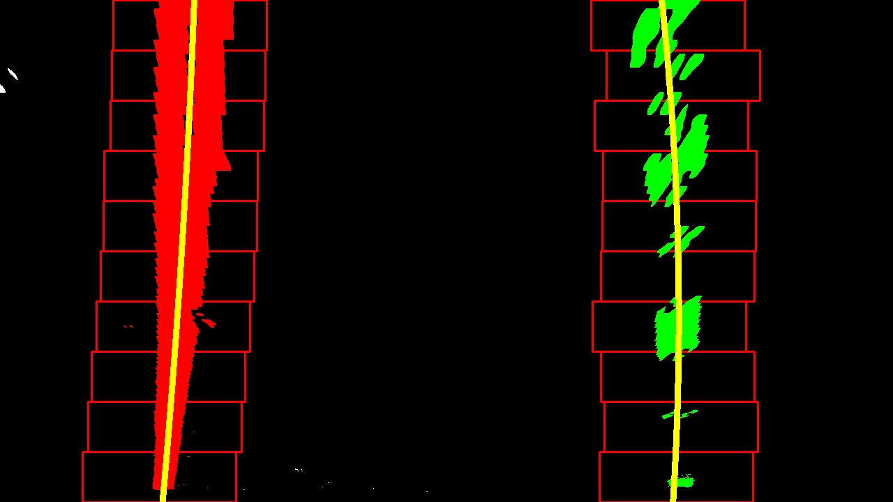

#### 5. Describe how (and identify where in your code) you calculated the radius of curvature of the lane and the position of the vehicle with respect to center.

Given the parameter of the polynomial fit calculated in `Fit_Lanes()`, the function `Lane_Curvatures` computes  the lane curvatures in pixel and meters and the relative to the lane center position of the car in meter. The arguments *Scale_Meter_Pixel_x* and *Scale_Meter_Pixel_y* define the ration meters per pixel of the images. 
The code of the functions is shwown below:

```python
def Lane_Curvatures (Binary_Warped_Img, Left_Lane_Fit, Right_Lane_Fit, Scale_Meter_Pixel_x, Scale_Meter_Pixel_y):
    #Curvature at the bottom of the image
    Y_Eval = Binary_Warped_Img.shape[0]
    
    #Calculation of curvature in Pixel
    Left_Curve_Radius_Pixel = ((1 + (2*Left_Lane_Fit[0]*Y_Eval + Left_Lane_Fit[1])**2)**1.5) / np.absolute(2*Left_Lane_Fit[0])
    
    Right_Curve_Radius_Pixel = ((1 + (2*Right_Lane_Fit[0]*Y_Eval + Right_Lane_Fit[1])**2)**1.5) / np.absolute(2*Right_Lane_Fit[0])
    
    #Lane Fit parameter conversion from pixel to meter
    Left_Lane_Fit_Meter =[Left_Lane_Fit[0]*Scale_Meter_Pixel_x/(Scale_Meter_Pixel_y**2),
                          Left_Lane_Fit[1]*Scale_Meter_Pixel_x/Scale_Meter_Pixel_y,
                          Left_Lane_Fit[2]]
    Right_Lane_Fit_Meter =[Right_Lane_Fit[0]*Scale_Meter_Pixel_x/(Scale_Meter_Pixel_y**2),
                          Right_Lane_Fit[1]*Scale_Meter_Pixel_x/Scale_Meter_Pixel_y,
                          Right_Lane_Fit[2]]
    Y_Eval_Meter = Y_Eval*Scale_Meter_Pixel_y
    
    #Calculation of curvature in meter
    Left_Curve_Radius_Meter = ((1 + (2*Left_Lane_Fit_Meter[0]*Y_Eval_Meter + Left_Lane_Fit_Meter[1])**2)**1.5) / np.absolute(2*Left_Lane_Fit_Meter[0])
    
    Right_Curve_Radius_Meter = ((1 + (2*Right_Lane_Fit_Meter[0]*Y_Eval_Meter + Right_Lane_Fit_Meter[1])**2)**1.5) / np.absolute(2*Right_Lane_Fit_Meter[0])
    
    Left_Lane_Base = Left_Lane_Fit[0]*Y_Eval**2 + Left_Lane_Fit[1]*Y_Eval + Left_Lane_Fit[2]
    Right_Lane_Base = Right_Lane_Fit[0]*Y_Eval**2 + Right_Lane_Fit[1]*Y_Eval + Right_Lane_Fit[2]
    
    Vehicle_Relative_Pos_Meter = ((Binary_Warped_Img.shape[1]/2) - ((Left_Lane_Base + Right_Lane_Base)/2))*Scale_Meter_Pixel_x

    Result = np.array([Vehicle_Relative_Pos_Meter, Left_Curve_Radius_Meter, Right_Curve_Radius_Meter, Left_Curve_Radius_Pixel, Right_Curve_Radius_Pixel])
    return Result
```

#### 6. Provide an example image of your result plotted back down onto the road such that the lane area is identified clearly.

The function `Draw_Lane()` fills the area between the two polynomials fit using `cv2.fillPoly()`. The obtained image is unwarped using the inverse atrix of the perspective in the function `cv2.warpPerspective()`. To Finally draw the filled laned back to the undistorted image, we used `cv2.addWeighted()`. Additionally the lane properties are written on the final image using `cv2.putText()`
```python
def Draw_Lane (Undistorted_Img, Binary_Warped_Img, Left_Lane_Fit, Right_Lane_Fit):
    
    Unwarped = np.dstack((Binary_Warped_Img, Binary_Warped_Img, Binary_Warped_Img))*0
    Plot_y= np.linspace(0, Binary_Warped_Img.shape[0]-1, Binary_Warped_Img.shape[0])
    Left_Lane_Fit_x = Left_Lane_Fit[0]*Plot_y**2 + Left_Lane_Fit[1]*Plot_y + Left_Lane_Fit[2]
    Right_Lane_Fit_x = Right_Lane_Fit[0]*Plot_y**2 + Right_Lane_Fit[1]*Plot_y + Right_Lane_Fit[2]
    Left_Lane_Boundary = (np.transpose(np.vstack((Left_Lane_Fit_x, Plot_y))))
    Right_Lane_Boudary = (np.flipud(np.transpose(np.vstack((Right_Lane_Fit_x, Plot_y)))))

    Lane_Boundary = np.array([np.vstack((Left_Lane_Boundary, Right_Lane_Boudary))], dtype=np.int32)
    
    #Fill the lane area
    cv2.fillPoly(Unwarped, Lane_Boundary, (0,255,0))
    
    #Filled lane unwarped and added to the undistorted image
    Unwarped = cv2.warpPerspective(Unwarped, Minv, (Unwarped.shape[1], Unwarped.shape[0]))
    Final = cv2.addWeighted(Undistorted_Img,1,Unwarped, 0.3, 0)
    
    #Compute and draw Lane properties
    Scale_Meter_Pixel_y = 30/700 # meters per pixel in y dimension
    Scale_Meter_Pixel_x = 3.7/800
    Lane_Paramater = Lane_Curvatures (Binary_Warped_Img, Left_Lane_Fit, Right_Lane_Fit, Scale_Meter_Pixel_x, Scale_Meter_Pixel_y)
    cv2.putText(Final, "Car Position: %.2f m" % (Lane_Paramater[0]),(50, 50), cv2.FONT_HERSHEY_SIMPLEX, 1, (255, 255, 255),2, cv2.LINE_AA)
    cv2.putText(Final, "Left Curvature: %.2f km" % (Lane_Paramater[1]/1000),(50,80), cv2.FONT_HERSHEY_SIMPLEX, 1, (255, 255, 255),2, cv2.LINE_AA)
    cv2.putText(Final, "Right Curvature: %.2f km" % (Lane_Paramater[2]/1000),(50, 110), cv2.FONT_HERSHEY_SIMPLEX, 1, (255, 255, 255),2, cv2.LINE_AA)
    
    return Final
```
Here's an example of my output for this step.

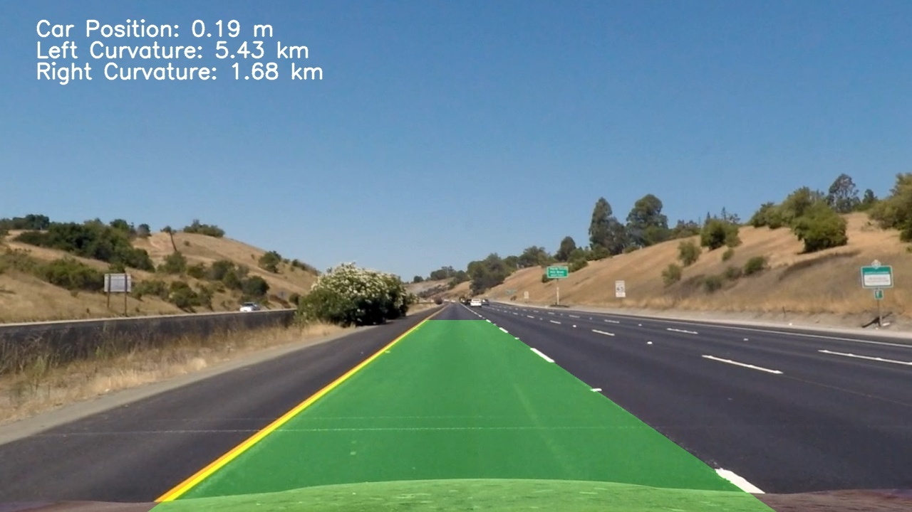

Here is a summary of the pipelines applied to all test images:

|                                                                              |                                                         |
|:------------------------------------------------------------------------------:|:---------------------------------------------------:|
|                                                                              |                                                         |
|                                                                              |                                                         |
|                                                                              |                                                         |
|                                                                              |                                                         |
|                                                                              |                                                         |
|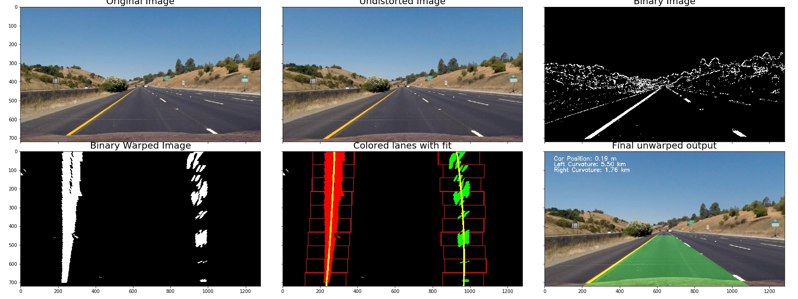  |  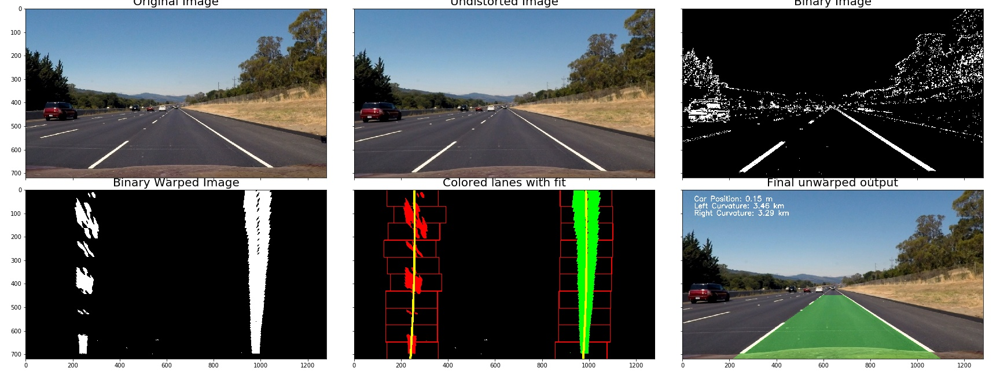|
|                                                                              |                                                         |
|                                                                              |                                                         |
|                                                                              |                                                         |
|                                                                              |                                                         |
|                                                                              |                                                         |
|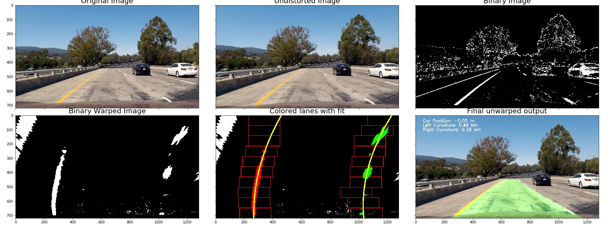  |  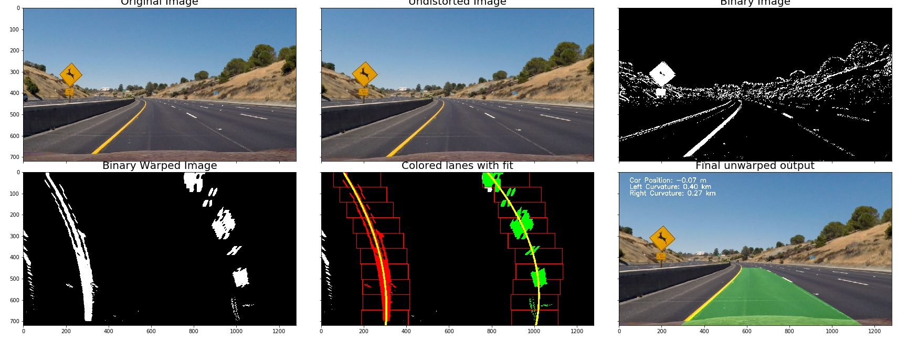|
|                                                                              |                                                         |
|                                                                              |                                                         |
|                                                                              |                                                         |
|                                                                              |                                                         |
|                                                                              |                                                         |
|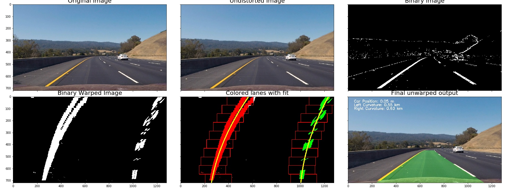  |  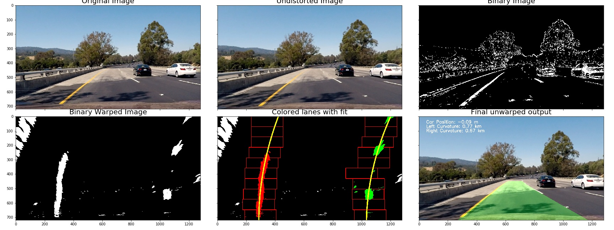|
|                                                                              |                                                         |
|                                                                              |                                                         |
|                                                                              |                                                         |
|                                                                              |                                                         |
|                                                                              |                                                         |
|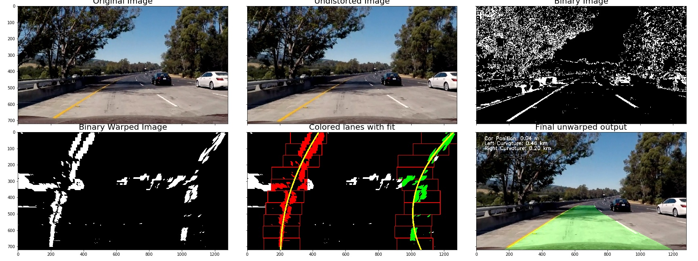  |  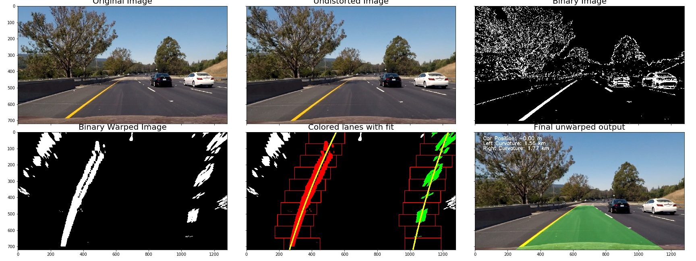|

### Pipeline (video)

#### 1. Provide a link to your final video output.  Your pipeline should perform reasonably well on the entire project video (wobbly lines are ok but no catastrophic failures that would cause the car to drive off the road!).

The video pipeline `Process_Image_Simple(Img)` process each images by applying the sliding method images. The code is shown below:
```python
def Process_Image_Simple(Img):
    # Undistort
    Undistorted_Img = cv2.undistort(Img, Mtx, Dist, None, Mtx)
    
    # Binary Threshold
    S_Color_binary = S_Color_Threshold(Undistorted_Img, S_Color_thresh = (150,255))
    Absolute_Sobel_x = Absolute_Sobel_Threshold(Undistorted_Img, orient='x', sobel_kernel=9, Abs_thresh=(20, 120))
    Absolute_Sobel_y = Absolute_Sobel_Threshold(Undistorted_Img, orient='y', sobel_kernel=9, Abs_thresh=(20, 120))
    Magnitude_Sobel = Magnitude_Threshold(Undistorted_Img, sobel_kernel=9, mag_thresh=(50, 255))
    Direction_Sobel = Direction_Threshold(Undistorted_Img, sobel_kernel=15, dir_thresh=(0.7,1.3))
    Binary_Img = np.zeros_like(S_Color_binary)
    Binary_Img [((Absolute_Sobel_x == 1) & (Absolute_Sobel_y == 1)) | ((Magnitude_Sobel == 1) & (Direction_Sobel == 1)) |
                (S_Color_binary == 1)] = 1
    
    # Warp Binary
    src = np.float32([[230, 700], [1100, 700], [690, 450], [590, 450]])
    dst = np.float32([[230,700], [1000, 700], [1000,0], [230,0]])
    M = cv2.getPerspectiveTransform(src, dst)
    Minv = cv2.getPerspectiveTransform(dst, src)
    Binary_Warped_Img = cv2.warpPerspective(Binary_Img, M, (Binary_Img.shape[1], Binary_Img.shape[0]), flags=cv2.INTER_LINEAR)
    
    #Fit Lane
    Lane_Fit_Img, Left_Lane_Fit, Right_Lane_Fit = Fit_Lanes(Binary_Warped_Img)
    
    # Draw Lane back
    Final_Img = Draw_Lane (Undistorted_Img, Binary_Warped_Img, Left_Lane_Fit, Right_Lane_Fit, Minv)
    
    return Final_Img
```
In order to apply this pipeline to the project video, we have the following cell code:
```python
Video = VideoFileClip('project_video.mp4')
Video_Output = Video.fl_image(Process_Image_Simple)
%time Video_Output.write_videofile('Project_Video_Output_Simple_Processing.mp4', audio=False)
```
Here's the [link to the result with the simple processing](Project_Video_Output_Simple_Processing.mp4)


As seen in the result, the lines are wobbly under certain conditions (change in road colors, shadows,...).
Therefore we enhanced the search and polynomial fit of the lane pixels by using an weighted average sum of previous polynomial fits. The function `Identify_Lane_Pixels()` is replaced by the function `Search_From_Prior()`, which uses information about previous lane to search the activated pixels
```python
def Search_From_Prior (Binary_Warped_Img, Prev_Left_Lane_Fit, Prev_Right_Lane_Fit):
    #Identifying indexes of all active pixels
    Non_Zero = Binary_Warped_Img.nonzero()
    Non_Zero_x = np.array(Non_Zero[1])
    Non_Zero_y = np.array(Non_Zero[0])
    
    #Search boundary around the previous fit
    Margin = 100
    Final_Out_Img = np.dstack((Binary_Warped_Img, Binary_Warped_Img, Binary_Warped_Img))*255
    
    #Initializing the search
    Left_Lane_Ind = ((Non_Zero_x >  (Prev_Left_Lane_Fit[0]*(Non_Zero_y**2) + Prev_Left_Lane_Fit[1]*Non_Zero_y + Prev_Left_Lane_Fit[2] - Margin)) 
                     & (Non_Zero_x < (Prev_Left_Lane_Fit[0]*(Non_Zero_y**2) + Prev_Left_Lane_Fit[1]*Non_Zero_y + Prev_Left_Lane_Fit[2] + Margin))) 
    Right_Lane_Ind = ((Non_Zero_x >  (Prev_Right_Lane_Fit[0]*(Non_Zero_y**2) + Prev_Right_Lane_Fit[1]*Non_Zero_y + Prev_Right_Lane_Fit[2] - Margin)) 
                     & (Non_Zero_x < (Prev_Right_Lane_Fit[0]*(Non_Zero_y**2) + Prev_Right_Lane_Fit[1]*Non_Zero_y + Prev_Right_Lane_Fit[2] + Margin))) 
    
    
    Left_x_Active = Non_Zero_x[Left_Lane_Ind]
    Left_y_Active = Non_Zero_y[Left_Lane_Ind]
    Right_x_Active = Non_Zero_x[Right_Lane_Ind]
    Right_y_Active = Non_Zero_y[Right_Lane_Ind]
    
    return Left_x_Active, Left_y_Active, Right_x_Active, Right_y_Active, Final_Out_Img
```
We therefore obtain a new `Fit_Lanes_Enhanced()`, which uses `Search_From_Prior()` instead of `Identify_Lane_Pixels()`.
```python
def Fit_Lanes_Enhanced (Binary_Warped_Img, Prev_Left_Left_Lane_Fit,Prev_Right_Lane_fit):
    Left_x_Active, Left_y_Active, Right_x_Active, Right_y_Active, Binary_Lane_Fit= Search_From_Prior(Binary_Warped_Img,
                                                                                                     Prev_Left_Left_Lane_Fit,
                                                                                                     Prev_Right_Lane_fit)
    
    #Fit a second order polynomial over the founded active pixel for each lane
    Left_Lane_Fit = np.polyfit(Left_y_Active, Left_x_Active, 2)
    Right_Lane_Fit = np.polyfit(Right_y_Active, Right_x_Active, 2)

    Plot_y= np.linspace(0, Binary_Warped_Img.shape[0]-1, Binary_Warped_Img.shape[0])
    
    try:
        Left_Lane_Fit_x = Left_Lane_Fit[0]*Plot_y**2 + Left_Lane_Fit[1]*Plot_y + Left_Lane_Fit[2]
        Right_Lane_Fit_x = Right_Lane_Fit[0]*Plot_y**2 + Right_Lane_Fit[1]*Plot_y + Right_Lane_Fit[2]
    except TypeError:
        # Avoidserror if fit was still impossible
        print('Fit not possible')
        Left_Lane_Fit_x = 1*Plot_y*2 + 1*Plot_y
        Right_Lane_Fit_x = 1*Plot_y*2 + 1*Plot_y


    Binary_Lane_Fit[Left_y_Active, Left_x_Active] = [255,0,0]
    Binary_Lane_Fit[Right_y_Active, Right_x_Active] = [0,255,0]
    
    #Draw the Fit lanes
    Left_Lane_Boundary = (np.transpose(np.vstack((Left_Lane_Fit_x, Plot_y))))
    Right_Lane_Boudary = (np.flipud(np.transpose(np.vstack((Right_Lane_Fit_x, Plot_y)))))
    cv2.polylines (Binary_Lane_Fit, np.array([Left_Lane_Boundary], dtype=np.int32), False, (255,255,0),8)
    cv2.polylines (Binary_Lane_Fit, np.array([Right_Lane_Boudary], dtype=np.int32), False, (255,255,0),8)

    return Binary_Lane_Fit, Left_Lane_Fit, Right_Lane_Fit
```
The new pipeline `Process_Image_Enhanced` to process the video frames is given below, where if available, the weighted mean of previous lane fit results are used. The pargument `Buffer_Size` determines the number of previous results used.
```python
def Process_Image_Enhanced (Buffer_Size):
    
    Left_Fit_Queue = deque(maxlen=Buffer_Size)
    Right_Fit_Queue = deque(maxlen=Buffer_Size)
    Weights = np.arange(1, Buffer_Size+1)/Buffer_Size
    
    #Process the image with windows only if previous results are not available
    def Process_Image(Img):
        # Undistort
        Undistorted_Img = cv2.undistort(Img, Mtx, Dist, None, Mtx)

        # Binary Threshold
        S_Color_binary = S_Color_Threshold(Undistorted_Img, S_Color_thresh = (150,255))
        Absolute_Sobel_x = Absolute_Sobel_Threshold(Undistorted_Img, orient='x', sobel_kernel=9, Abs_thresh=(20, 120))
        Absolute_Sobel_y = Absolute_Sobel_Threshold(Undistorted_Img, orient='y', sobel_kernel=9, Abs_thresh=(20, 120))
        Magnitude_Sobel = Magnitude_Threshold(Undistorted_Img, sobel_kernel=9, mag_thresh=(50, 255))
        Direction_Sobel = Direction_Threshold(Undistorted_Img, sobel_kernel=15, dir_thresh=(0.7,1.3))
        Binary_Img = np.zeros_like(S_Color_binary)
        Binary_Img [((Absolute_Sobel_x == 1) & (Absolute_Sobel_y == 1)) | ((Magnitude_Sobel == 1) & (Direction_Sobel == 1)) |
                    (S_Color_binary == 1)] = 1

        # Warp Binary
        src = np.float32([[230, 700], [1100, 700], [690, 450], [590, 450]])
        dst = np.float32([[230,700], [1000, 700], [1000,0], [230,0]])
        M = cv2.getPerspectiveTransform(src, dst)
        Minv = cv2.getPerspectiveTransform(dst, src)
        Binary_Warped_Img = cv2.warpPerspective(Binary_Img, M, (Binary_Img.shape[1], Binary_Img.shape[0]), flags=cv2.INTER_LINEAR)

        #Fit Lane, if applicable use prior results
        if len(Left_Fit_Queue)==0:
            Lane_Fit_Img, Left_Lane_Fit, Right_Lane_Fit = Fit_Lanes(Binary_Warped_Img)
        else:
            Lane_Fit_Img, Left_Lane_Fit, Right_Lane_Fit = Fit_Lanes_Enhanced(Binary_Warped_Img,
                                                                             np.average(Left_Fit_Queue,0,Weights[-len(Left_Fit_Queue):]),
                                                                             np.average(Right_Fit_Queue,0,Weights[-len(Right_Fit_Queue):]),)
        #Save last results in the buffer queue
        Left_Fit_Queue.append(Left_Lane_Fit)
        Right_Fit_Queue.append(Right_Lane_Fit)
        
        # Draw Lane back using mean of actual Buffer Queue
        Final_Img = Draw_Lane (Undistorted_Img, Binary_Warped_Img,
                               np.average(Left_Fit_Queue,0,Weights[-len(Left_Fit_Queue):]),
                               np.average(Right_Fit_Queue,0,Weights[-len(Right_Fit_Queue):]), Minv)

        return Final_Img
    return Process_Image
```
We choose an average on the `Buffer_Size = 50` to procees anew the project video.
```python
Video = VideoFileClip('project_video.mp4')
Video_Output_Enhanced = Video.fl_image(Process_Image_Enhanced(50))
%time Video_Output_Enhanced.write_videofile('Project_Video_Output_Enhanced_Processing.mp4', audio=False)
```
Here's the [link to the result with the enhanced processing](Project_Video_Output_Enhanced_Processing.mp4)

### Discussion

#### 1. Briefly discuss any problems / issues you faced in your implementation of this project.  Where will your pipeline likely fail?  What could you do to make it more robust?

##### Worked well
* I was able to follow the steps as described in the lecture materials for color and gradient thresholding, perspective transform, lane fitting and curvature calculation. The enhanced processing also performed well and made the pileline more robust.

##### Difficulties
* Find the right thresholds for binary conversion: this step was really exhausting and time consuming

##### Could be improved
* Code reused within the different helper functions
